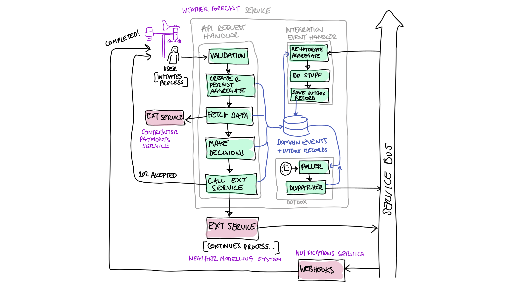
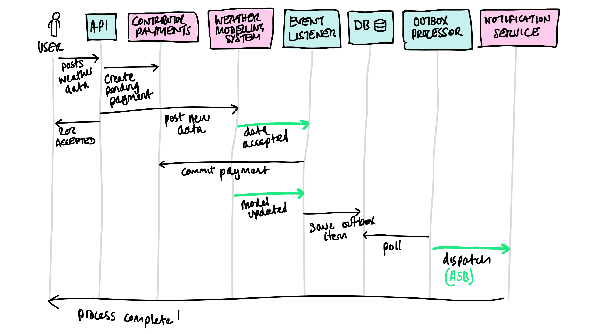

# event-sourced-but-flow-driven-example

An example repo which uses fluent method chaining and domain events to achieve an eventsourced but flow-driven architecture

I use it to try things out, to demonstrate things in talks and to share with anyone who might find it useful.

## Interesting things in this repo:

- Fluent method chaining to create super clear orchestration code [CollectedWeatherDataOrchestrator](./src/WeatherApp.Application/Orchestration/CollectedWeatherDataOrchestrator.cs)
- Use of OneOf discriminated unions library to avoid use of exceptions for non-exception scenarios [CreateResponseFor()](./src/WeatherApp.API/Program.cs#65)
- E2e component tests (lots of cool stuff in here😁) [here](./tests/WeatherApp.Tests/)
    - Using FakeTimeProvider to control the time during tests [here](./tests/WeatherApp.Tests/ComponentTestFixture.cs#52)
- Retryable Dapper db connection with transactions [here](./src/WeatherApp.Infrastructure/RetryableDapperConnection/)
- Event sourcing using a SQL table of domain events [here](./src/WeatherApp.Domain/EventSourcing/)
- Aspire providing a sublime local dev experience [appHost here](./AppHost/Program.cs)
- OTEL tracing [here](./src/WeatherApp.Infrastructure/Outbox/OutboxDispatcherHostedService.cs#107)
- Integration tests with Aspire [here](./tests/WeatherApp.Tests.Aspire.Integration/WeatherAppAspireIntegrationTests.cs#43)
- A Source Generator which will take constants and place them in an immutable dictionary in a partial class, for classes decorated with an attribute, very handy for service bus Type -> entity name mapping 😊 [here](./src/WeatherApp.SourceGenerators/AutoGenerateImmutableDictionyFromConstantsGenerator.cs)

## Scenario outline

## Scenario Happy Path Sequence

## Talks

### Fluent Method Chaining in C# and orchestration code so clear your product owner can read it!

[.Net London, November 2024, YouTube](https://www.youtube.com/watch?v=1Yf5zN_iR5Q)

### How to fall in love with automated tests!

[PDF from GoogleSlides](./notebooks/media/How%20to%20fall%20in%20love%20with%20automated%20tests!.pdf)